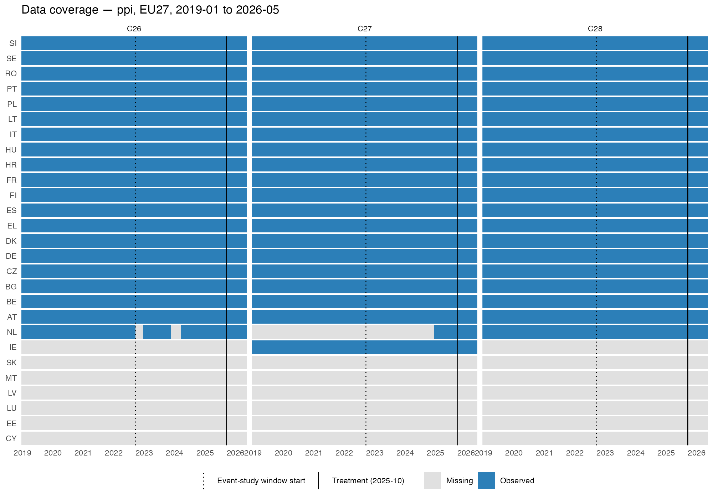
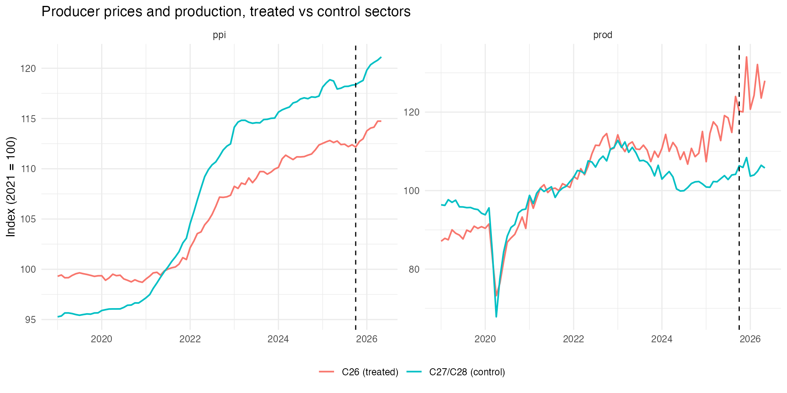
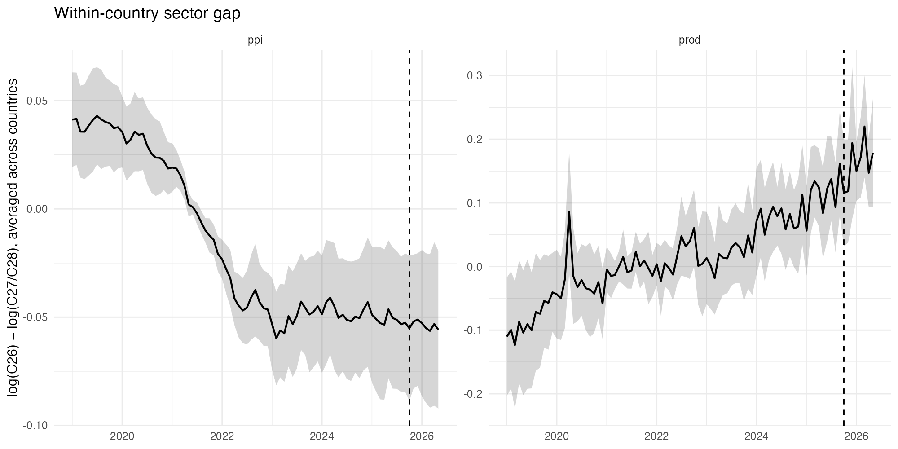
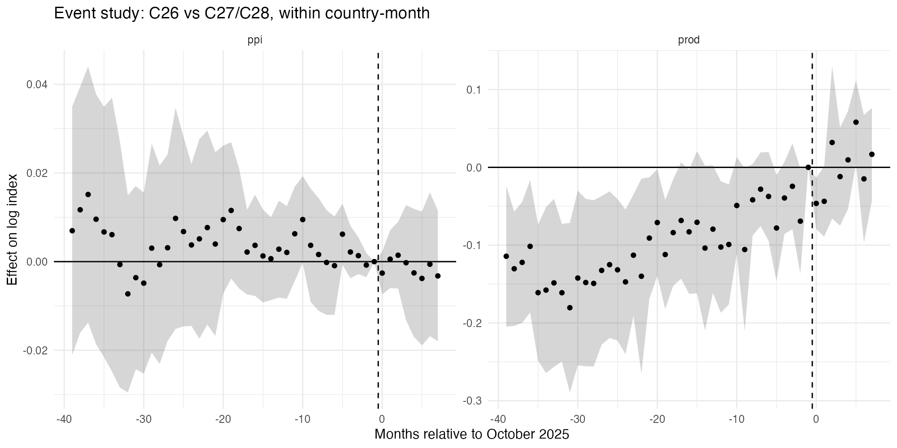
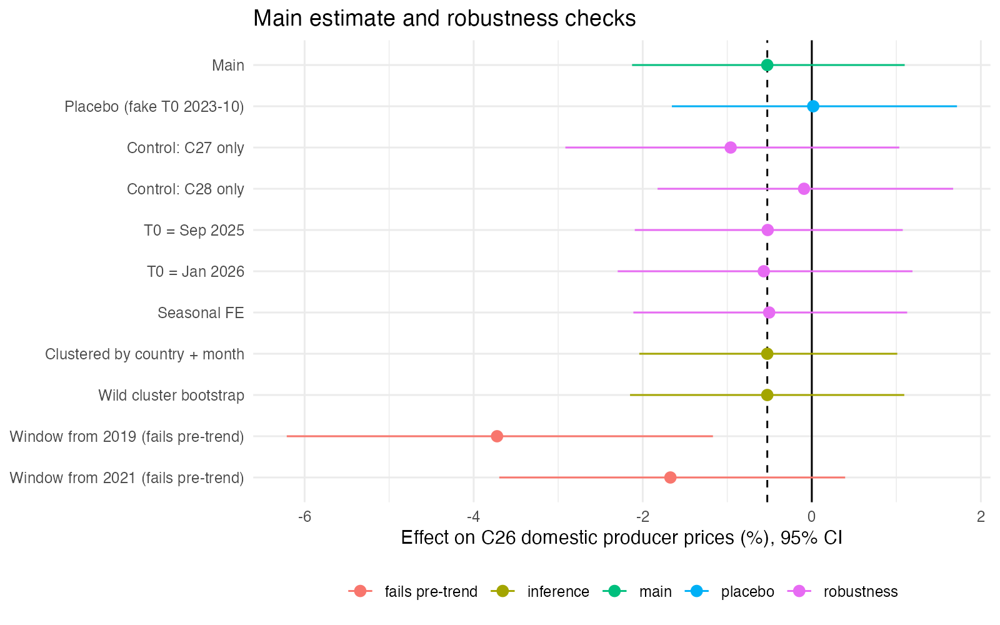
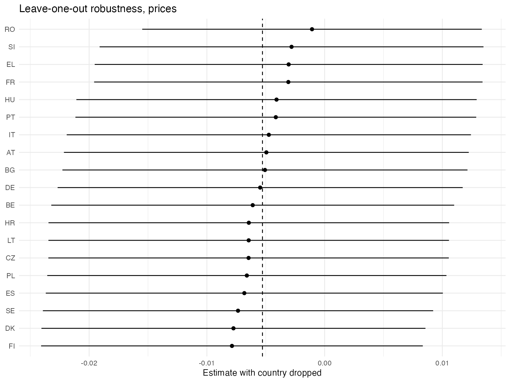

```{r setup, include = FALSE}
knitr::opts_chunk$set(echo = TRUE, message = FALSE, warning = FALSE,
                      fig.align = "center", out.width = "100%")

library(tidyverse)
library(fixest)
library(knitr)

# Everything is read from disk; the report fits no models.
checks    <- readRDS("data/processed/checks.rds")
es_df     <- readRDS("data/processed/es_df.rds")
loo       <- readRDS("data/processed/loo.rds")
models    <- readRDS("data/processed/models.rds")
pretrends <- readRDS("data/processed/pretrends.rds")

stopifnot(nrow(checks) > 0, nrow(es_df) > 0, nrow(loo) > 0, nrow(pretrends) > 0)

# Helpers for numbers written into the text
pct  <- function(x) sprintf("%.1f%%", x)
main <- filter(checks, check == "Main")

chk <- function(label) {
  r <- filter(checks, check == label)
  stopifnot(nrow(r) == 1)
  r
}
ci_txt <- function(label) {
  r <- chk(label)
  sprintf("%.1f%% (95%% CI %.1f%% to %.1f%%)", r$est_pct, r$lo_pct, r$hi_pct)
}

win <- filter(pretrends, start == as.Date("2022-07-01"))
stopifnot(nrow(win) == 1)                       # the chosen window must be in the table

loo_rng <- 100 * (exp(range(loo$est)) - 1)
```

# Summary

The estimated relative change in C26 producer prices is
`r pct(main$est_pct)` (95% CI `r pct(main$lo_pct)` to `r pct(main$hi_pct)`).

Eight months after memory-chip prices roughly quadrupled, European producers
of computers, electronic and optical products (NACE C26) had not raised their
domestic prices faster than comparable manufacturers in the same countries.
The confidence interval rules out a relative price increase above about
`r pct(main$hi_pct)`; allowing for pre-existing trends too small to detect,
effects above roughly 3–4% are excluded. Higher memory costs had not shown up in 
C26 output prices by May 2026, either because contract prices had not yet
adjusted, or because costs were absorbed in margins or inventories; this data
cannot tell which.

# Question and background

From October 2025, DRAM prices rose sharply: a 16Gb DDR5 chip went from
roughly \$6.84 in September 2025 to about \$27.20 by December 2025. The cause
was on the supply side. Memory manufacturers reallocated capacity toward
high-bandwidth memory (HBM) for AI data centres, reducing supply of
conventional DRAM. The shock therefore did not originate in demand from
European manufacturers, which makes it external to the industries studied.

The question is one of **cost pass-through**: when an input becomes more
expensive, how much of the increase reaches the prices customers pay, and with
what delay. Sectors differ sharply in how much memory they use. Computers,
electronic and optical products (C26) are memory-intensive; electrical
equipment (C27) and machinery (C28) use very little. If memory costs were
passed on, C26 prices should have risen relative to C27 and C28 from late
2025.

# Data and sample

**Sources.** Eurostat monthly short-term business statistics, downloaded on
2026-09-20. Official statistics are revised over time, so the analysis is
pinned to this vintage.

| Series | Dataset | Unit | Adjustment |
|---|---|---|---|
| Producer prices, domestic market | `sts_inppd_m` | Index, 2021 = 100 | Not seasonally adjusted |
| Production in industry | `sts_inpr_m` | Index, 2021 = 100 | Seasonally and calendar adjusted |

Domestic-market prices are used rather than total or export prices. Export
prices carry exchange-rate movements, and C26 exports more than its controls,
so that variation would not cancel between sectors.

**Period.** January 2019 to May 2026. The window ends in May 2026 because
Portugal's production reporting becomes incomplete from June 2026; dropping a
month costs one month, while dropping a country costs every month.

**Sample rule.** The population is the EU27 member states, which also excludes
Eurostat aggregates such as the EU and euro-area totals. A country is eligible
for an outcome if C26, C27 and C28 all have complete monthly data across the
whole period. This gives **19 countries for prices** and 15 for production.
The rule was set on data availability alone, before any outcome was examined.

Two checks support it. A relaxed rule, requiring C26 plus at least one
complete control sector, produced an identical sample: every exclusion is
caused by an incomplete C26 series, none by missing controls. And the
near-miss countries have internal gaps rather than late starts (Netherlands
prices are missing from October 2022 to March 2024; Portugal's production from
February to March 2025, inside the analysis window). Admitting them would make
the composition of the comparison change from month to month, so the strict
rule is kept.

The excluded countries are mostly small economies, where Eurostat suppresses
C26 data because a handful of firms would make published figures identifiable.
The sample is therefore weighted toward larger manufacturing economies.

```{r coverage, echo = FALSE}

```

# Design

The estimate comes from a difference-in-differences model with interacted
fixed effects:

$$\log P_{cst} = \alpha_{cs} + \delta_{ct} + \beta D_{cst} + \varepsilon_{cst}$$

where $c$ is the country, $s$ the sector, $t$ the month, and $D_{cst} = 1$ for
C26 from October 2025 onward.

- **Country × month effects** ($\delta_{ct}$) compare the three sectors within
  the same country and month. Every shock that hits a country's whole economy
  in a given month — energy prices, inflation, exchange rates, shared
  seasonality — is absorbed.
- **Country × sector effects** ($\alpha_{cs}$) compare each series with
  itself, so the arbitrary index bases do not matter.
- **Logs** make $\beta$ read approximately as a percentage; exact percentages
  are reported as $100(e^{\beta} - 1)$.

Standard errors are clustered by country, allowing any pattern of correlation
within a country over time. With 19 clusters, conventional clustered errors
can be too small, so a wild cluster bootstrap is also reported.

**Key assumption.** Without the memory shock, the C26-versus-control price
gap would have continued on its pre-shock path. This is checked below.

**Known blind spot.** The design cannot separate the memory shock from any
other change that affected European electronics prices in all countries at
the same time. Every country's C26 is treated at the same moment, so there is
no untreated electronics sector to compare with.

## Descriptive evidence

```{r trends, echo = FALSE}

```

Each series is an index normalised to its own 2021 average, so all lines meet
around 2021 by construction. Heights and distances between lines carry no
information; only slopes do. Prices of the control sectors rose much faster
than C26 during 2021–22, then both groups rose at similar rates. After October
2025, both groups rose again by similar amounts.

```{r gap, echo = FALSE}

```

This figure shows the design directly: the log difference between C26 and
the control average, computed within each country and month and then averaged
across countries. Its level is meaningless; its movement is the quantity the
model estimates. The gap falls from about +0.04 in 2019 to about −0.05 by
mid-2022, then stays flat through May 2026. The fall reflects the European
energy and commodity shock: C27 and C28 are metal- and energy-intensive, so
their prices rose more than those of C26. Across October 2025 the gap moves
from roughly −0.052 to −0.055, visually close to zero.

The ribbon shows how much countries disagree in each month
(±1.96 standard errors across countries). It is not a test of significance.

## Choosing the estimation window

The 2019–22 fall rules out using the full history: a baseline that includes
it would attribute the energy shock to the memory shock. The start of the
estimation window was therefore chosen by a rule fixed in advance and
committed before any post-shock regression was run: **the earliest candidate
start date whose pre-shock gap shows no significant linear drift**
($p > 0.05$, clustered by country). The rule takes the earliest qualifying
date, not the one giving the most convenient answer, and uses only
pre-shock data.

```{r pretrends}
pretrends |>
  select(-lever) |>
  kable(digits = 4,
        col.names = c("Window start", "Drift per year", "SE per year",
                      "p", "Pre-months", "Max bias (pp)"))
```

Windows starting in 2019 and 2021 show significant downward drift. July 2022
is the earliest start that passes, with an estimated drift of
`r sprintf("%.4f", win$slope_per_year)` per year ($p$ =
`r sprintf("%.2f", win$p)`). The window therefore runs from July 2022 to May
2026: 39 months before the shock and 8 after.

Failing to detect drift is not proof that there is none. The last column
translates the uncertainty in the drift estimate into its largest possible
effect on the main estimate. The average post-shock month lies 23.5 months
after the average pre-shock month, so a steady drift at the edge of its
confidence interval would shift the estimate by up to
`r sprintf("%.1f", win$bias_bound)` percentage points. Conclusions below that
threshold are not supported by this design.

# Results

## Main estimate

```{r main}
etable(models$main$ppi)
```

The estimated relative change in C26 prices is `r ci_txt("Main")`. The point
estimate is slightly negative but indistinguishable from zero. The useful
number is the upper end of the interval: pass-through larger than about
`r pct(main$hi_pct)` within eight months is ruled out. Adding the drift
allowance from the previous section gives a conservative bound of roughly
3–4%.

A naive comparison would tell a different story. C26 prices did rise after
October 2025, by about 2%, but comparable sectors rose by the same amount. The
memory-specific part of the increase is approximately zero.

## Event study

```{r event-study, echo = FALSE}

```

The event study estimates the gap in every month relative to September 2025,
the last month before the shock.

For prices (left panel), the months before the shock scatter around zero and
every interval includes zero. The earliest months sit slightly above zero,
the small downward tilt measured by the drift test. There is no recurring
pattern in the January coefficients, so no sign of a C26-specific January
price reset. After the shock, the coefficients stay between about −0.4% and
+0.1%: no jump in October, no spike in January 2026 when annual contracts
renew, and no build-up by May 2026.

The small negative main estimate comes mostly from the pre-shock months
sitting slightly above the September 2025 reference, not from prices falling
after the shock.

The right panel shows production, which is discussed separately below.

# Robustness

```{r robustness, echo = FALSE}

```

```{r checks-table}
checks |>
  select(check, est_pct, lo_pct, hi_pct, p) |>
  kable(digits = c(NA, 1, 1, 1, 2),
        col.names = c("Check", "Estimate (%)", "CI low", "CI high", "p"))
```

**Placebo.** The same model, applied to a fake shock in October 2023 using
only pre-shock data, gives `r ci_txt("Placebo (fake T0 2023-10)")`. The
design does not produce effects at dates where nothing happened, so a
coincidental shift exactly at October 2025 is unlikely.

**Control group.** Using each control alone gives
`r pct(chk("Control: C27 only")$est_pct)` against C27 and
`r pct(chk("Control: C28 only")$est_pct)` against C28. The main estimate is
exactly their average. Neither comparison reveals a hidden positive effect,
so there is no sign that a partly memory-using control is masking
pass-through.

**Timing.** Dating the shock one month earlier gives
`r pct(chk("T0 = Sep 2025")$est_pct)`; dating it to January 2026, when annual
contracts renew, gives `r pct(chk("T0 = Jan 2026")$est_pct)`. If pass-through
had started at the January renewals, the January estimate would be higher.
It is not.

**Seasonality.** Prices are not seasonally adjusted, and the post-shock months
(October–May) do not include June to September. Giving each country-sector its
own calendar-month effects gives `r ci_txt("Seasonal FE")`, essentially
unchanged.

**Leave one country out.** Dropping each country in turn gives estimates
between `r pct(loo_rng[1])` and `r pct(loo_rng[2])`, all inside the main
confidence interval. No single country drives the result.

**Inference.** Clustering by both country and month, which allows shocks
correlated across countries, gives a 95% interval of
`r pct(chk("Clustered by country + month")$lo_pct)` to
`r pct(chk("Clustered by country + month")$hi_pct)`. The wild cluster
bootstrap, designed for small numbers of clusters, gives
`r pct(chk("Wild cluster bootstrap")$lo_pct)` to
`r pct(chk("Wild cluster bootstrap")$hi_pct)`
($p$ = `r sprintf("%.2f", chk("Wild cluster bootstrap")$p)`), practically
identical to the main interval.

**Windows that fail the drift test.** For comparison, starting the window in
2019 gives `r pct(chk("Window from 2019 (fails pre-trend)")$est_pct)`. This
is not a robustness failure: the earlier baseline includes the energy-shock
decline in the gap, which the drift test had already rejected. It shows the
size of the error the window rule avoids.

```{r loo, echo = FALSE}

```

# Production: a reported design failure

Production was examined as a second outcome but is not reported as a causal
estimate. The production gap rises steadily from about −0.01 in early 2023 to
+0.115 at the shock and +0.17 by May 2026, with no visible break at October
2025. Both Figure 2 and the event study shows the same pattern: the pre-shock
coefficients climb toward zero for years before the shock,and many of them
exclude zero.

The original plan used the 15 countries eligible for both outcomes, so that 
price and production effects would describe the same economies. After the
descriptive figures showed production fails the parallel-trends assumption, 
before any price regression), production was dropped as an outcome and the main
specification uses all 19 price-eligible countries.

The pre-shock drift of about 0.0045 per month alone predicts a rise of about
0.036 over eight months, against an observed 0.055. A difference-in-differences
estimate would therefore report a large positive effect, most of it a
continuation of an existing trend. No choice of start date fixes this: the
trend continues through the shock.

One possible explanation, not tested here, is that AI data-centre demand raised
European electronics output over the same period in which it constrained memory 
supply. One cause behind both, hitting European electronics in all countries at
once, is exactly the kind of shock the design cannot absorb. The parallel-trends
assumption fails, and no effect is claimed.

# Limitations

- **Sector-level data.** C26 also covers optical products, instruments and
  components with little memory content. The bound applies to the sector as a
  whole; increases for the most memory-intensive products within it could be
  larger and still be hidden.
- **Common shocks.** Any change affecting European electronics prices in all
  countries at once cannot be separated from the memory shock. A downward
  pressure coinciding with the shock — cheaper imports, for example — could
  mask a real increase.
- **Sample.** The 19 countries are mostly larger economies; small countries
  are excluded because their C26 data is confidential.
- **Horizon.** Eight months. Pass-through through annual contract renewals
  could still appear in later data.
- **Measurement.** Quality adjustment in technology price indices can dampen
  measured price increases.
- **Few clusters.** Inference rests on 19 countries. The bootstrap gives the
  same interval, but the effective sample remains small.

# Reproducibility

The analysis is a six-script pipeline in `R/`. Each script reads its inputs
from disk and writes its outputs to disk; none depends on objects left in
memory by another, and each can be re-run in a fresh session.

| Script | Output |
|---|---|
| `01_download.R` | Raw Eurostat tables, saved with their download date |
| `02_clean.R` | One observation per country, sector and month |
| `03_audit.R` | Balanced panel of eligible countries, coverage figures |
| `04_models.R` | Window selection, all models, robustness results |
| `05_figures.R` | All figures |
| `06_render.R` | This report |

Every script checks its own output with `stopifnot()`, so the pipeline halts
rather than writing invalid data. The country rule and the estimation window
were decided on data availability and pre-shock evidence only, written into
`memo.md`, and committed before any post-shock regression was run; the commit
history records the order. Package versions are pinned with `renv`, and the
data is pinned to the 2026-09-20 Eurostat vintage. A fresh download retrieves
the current vintage, so results may differ slightly as Eurostat revises its
figures.